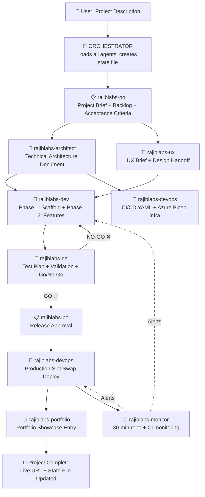
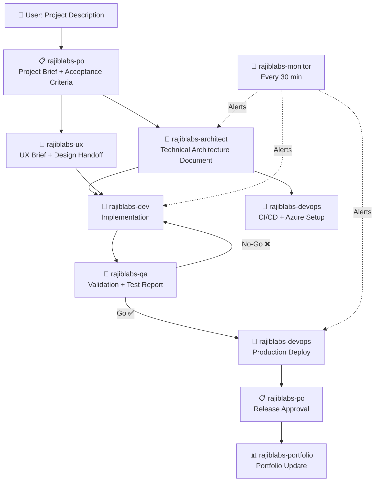

# 🏭 RajibLabs AI Workforce — Master Workflow
**Platform:** OpenClaw AI  
**Repository:** rajibmahata/rajiblabs-platform

---

## Workforce Overview

This is the master instruction file for the **RajibLabs AI Workforce** — a team of 8 specialised AI agents that collaborate to take a project from idea to production.

| Agent | ID | Role | Schedule |
|-------|----|------|----------|
| 📋 [rajiblabs-po](./rajiblabs-po.md) | 51011256 | Product Owner | Daily 8 AM IST + on-demand |
| 🎨 [rajiblabs-ux](./rajiblabs-ux.md) | 63c7532d | UI/UX Designer | On-demand |
| 🧠 [rajiblabs-architect](./rajiblabs-architect.md) | e441e421 | Architect & PM | On-demand |
| 👷 [rajiblabs-dev](./rajiblabs-dev.md) | 87745ce0 | Developer (→ Copilot ACP) | On-demand |
| 🧪 [rajiblabs-qa](./rajiblabs-qa.md) | 7a4d415c | QA Validator | On-demand |
| 🚀 [rajiblabs-devops](./rajiblabs-devops.md) | 16954a53 | DevOps (CI/CD, Azure) | On-demand |
| 👀 [rajiblabs-monitor](./rajiblabs-monitor.md) | eb6f6a39 | GitHub Monitor | Every 30 minutes |
| 📊 [rajiblabs-portfolio](./rajiblabs-portfolio.md) | 0a069639 | Portfolio Content | Daily 9 AM IST |

---

## ⚡ How to Start a New Project (3 Steps)

### Step 1 — Load the Orchestrator in OpenClaw
Open a new chat in OpenClaw and paste the **entire contents** of [`ORCHESTRATOR.md`](./ORCHESTRATOR.md) as your system prompt / persona instruction.

### Step 2 — Describe your project
Type your project description in plain English. That's it.

```
Example:
"Build a SaaS invoicing tool where freelancers can create invoices, 
track payments, and send automated payment reminders. 
Tech: React frontend, .NET 8 backend, Azure SQL database."
```

### Step 3 — Save the state file between sessions
At the end of each session, save the `agents/state/<project-slug>.md` output.  
Paste it back at the start of your next session and the Orchestrator will resume exactly where it left off.

---

## 🧠 Memory & State Tracking

All project progress is tracked in a **project state file**:

```
agents/state/<project-slug>.md
```

- Created from [`project-state-template.md`](./project-state-template.md) by `rajiblabs-po` at project start.
- Every agent reads it before starting work and writes results back to it.
- Contains: feature status, agent outputs, QA results, deployment URLs, open questions.
- Acts as the **persistent memory** across sessions — paste into OpenClaw to resume.

---

## Full Automated Lifecycle



---

## Phases Summary

| Phase | Name | Agents Active | Gate |
|-------|------|---------------|------|
| 0 | Discovery | po, architect, ux | Project Brief + TAD + UX Brief approved |
| 1 | Foundation | dev, devops | Scaffold compiles + CI pipelines live |
| 2 | Core Features | dev, qa | All Must Haves pass QA GO verdict |
| 3 | Polish & Deploy | dev, qa, devops, po | Release Approval + Production smoke test |
| 4 | Post-Launch | portfolio, monitor | Portfolio updated + monitoring active |

---

## What Each Agent Produces (Real Files)

| Agent | Produces |
|-------|---------|
| `rajiblabs-po` | Project Brief section in state file, workforce activation instructions |
| `rajiblabs-architect` | TAD + data models + API contract in state file |
| `rajiblabs-ux` | UX Brief + component inventory + Design Handoff in state file |
| `rajiblabs-dev` | Complete backend code (`backend/`), complete frontend code (`frontend/`), `.env.example` |
| `rajiblabs-devops` | `.github/workflows/pr.yml`, `.github/workflows/staging.yml`, `.github/workflows/production.yml`, `infra/main.bicep`, `infra/parameters.prod.json` |
| `rajiblabs-qa` | Test Plan + Test Report + defect list in state file |
| `rajiblabs-portfolio` | Project Showcase Entry JSON + `fallbackData.ts` patch |
| `rajiblabs-monitor` | 30-minute cycle reports, real-time alerts |

---

## Agent Communication Protocol

When an agent completes its output, it MUST:
1. Mark its section ✅ in the state file.
2. Announce the handoff:

```
## ✅ Handoff from rajiblabs-[agent]
Output produced: [deliverable name]
Delivered to: rajiblabs-[next agent]
Next action: [specific instruction]
Open questions: [any / none]
```

3. The Orchestrator then activates the next agent automatically.

---

## Escalation Path

```
Agent blocked on scope/priority  →  rajiblabs-po
Agent blocked on technical design →  rajiblabs-architect
Security finding (any severity)   →  rajiblabs-architect + rajiblabs-devops (immediate)
Production incident               →  rajiblabs-devops (immediate, skip normal cycle)
QA NO-GO after 2 fix cycles      →  rajiblabs-po (scope/design decision needed)
```

---

## Quality Gates (Nothing Passes Without These)

| Gate | Enforced By | Required Before |
|------|-------------|-----------------|
| Project Brief complete | rajiblabs-po | TAD and UX work starts |
| TAD approved | rajiblabs-architect | Any code is written |
| CI passing on PR | rajiblabs-devops | Merge to develop |
| QA GO verdict | rajiblabs-qa | Production deploy |
| Release Approval | rajiblabs-po | rajiblabs-devops triggers production |
| Production smoke test | rajiblabs-devops | Deploy declared complete |

---

## Security Non-Negotiables (All Agents, Always)

1. No secrets in code or committed files — Key Vault or environment variables only.
2. Validate all API inputs at the boundary.
3. Parameterised queries only — never concatenate SQL strings.
4. HTTPS enforced on all environments.
5. Dependabot enabled on every repository.
6. Least-privilege service principals and managed identities.
7. Sanitise all user-generated content before rendering (no XSS).
8. Every API endpoint is either explicitly public or requires auth token.

---

## Tech Stack Defaults

| Layer | Default |
|-------|---------|
| Frontend | React 18 + TypeScript + Vite + Tailwind CSS |
| Backend | .NET 8 ASP.NET Core Minimal API |
| ORM | Entity Framework Core (code-first) |
| Database | Azure SQL Database |
| Frontend Hosting | Azure Static Web Apps |
| Backend Hosting | Azure App Service (Linux) |
| Secrets | Azure Key Vault |
| CI/CD | GitHub Actions |
| Monitoring | Azure Application Insights |
| Auth | JWT Bearer / Azure AD B2C |

---

## File Structure

```
agents/
├── README.md                      ← This file (master workflow)
├── ORCHESTRATOR.md                ← Load this in OpenClaw to start any project
├── project-state-template.md      ← Shared memory template (copied per project)
├── rajiblabs-po.md                ← Product Owner
├── rajiblabs-architect.md         ← Architect & PM
├── rajiblabs-ux.md                ← UI/UX Designer
├── rajiblabs-dev.md               ← Developer
├── rajiblabs-qa.md                ← QA Validator
├── rajiblabs-devops.md            ← DevOps (real GitHub Actions YAML + Bicep)
├── rajiblabs-monitor.md           ← GitHub Monitor (30-min)
├── rajiblabs-portfolio.md         ← Portfolio Content
└── state/
    └── <project-slug>.md          ← Per-project memory (created at project start)
```

---

## Quick Reference: Who to Ask

| Question | Ask |
|----------|-----|
| What should we build? | `rajiblabs-po` |
| How should we build it? | `rajiblabs-architect` |
| What should it look like? | `rajiblabs-ux` |
| Write the code | `rajiblabs-dev` |
| Does it work correctly? | `rajiblabs-qa` |
| Deploy it / set up CI-CD | `rajiblabs-devops` |
| What's happening in the repo right now? | `rajiblabs-monitor` |
| Update the portfolio | `rajiblabs-portfolio` |
| Run the full project end-to-end | **ORCHESTRATOR** |

---

## Workforce Overview

This is the master instruction file for the **RajibLabs AI Workforce** — a team of 8 specialised AI agents that collaborate to take a project from idea to production.

| Agent | ID | Role | Schedule |
|-------|----|------|----------|
| 📋 [rajiblabs-po](./rajiblabs-po.md) | 51011256 | Product Owner | Daily 8 AM IST + on-demand |
| 🎨 [rajiblabs-ux](./rajiblabs-ux.md) | 63c7532d | UI/UX Designer | On-demand |
| 🧠 [rajiblabs-architect](./rajiblabs-architect.md) | e441e421 | Architect & PM | On-demand |
| 👷 [rajiblabs-dev](./rajiblabs-dev.md) | 87745ce0 | Developer (→ Copilot ACP) | On-demand |
| 🧪 [rajiblabs-qa](./rajiblabs-qa.md) | 7a4d415c | QA Validator | On-demand |
| 🚀 [rajiblabs-devops](./rajiblabs-devops.md) | 16954a53 | DevOps (CI/CD, Azure) | On-demand |
| 👀 [rajiblabs-monitor](./rajiblabs-monitor.md) | eb6f6a39 | GitHub Monitor | Every 30 minutes |
| 📊 [rajiblabs-portfolio](./rajiblabs-portfolio.md) | 0a069639 | Portfolio Content | Daily 9 AM IST |

---

## How to Start a New Project

**Simply provide a project description in plain English.** The workforce will self-organise.

### Example
> "Build a SaaS invoicing tool where freelancers can create invoices, track payments, and send automated payment reminders."

The workforce will automatically:
1. `rajiblabs-po` → writes Project Brief with feature backlog and acceptance criteria
2. `rajiblabs-architect` → writes Technical Architecture Document
3. `rajiblabs-ux` → writes UX Brief and Design Handoff
4. `rajiblabs-dev` → implements the features
5. `rajiblabs-qa` → validates all features
6. `rajiblabs-devops` → deploys to Azure
7. `rajiblabs-portfolio` → updates portfolio

---

## Full Project Lifecycle



---

## Agent Communication Rules

### How Agents Hand Off Work
When an agent completes its output, it must:
1. State clearly which output it produced (e.g., "✅ Technical Architecture Document complete").
2. State which agent(s) should receive it and act next.
3. List any open questions or dependencies that must be resolved before the next agent proceeds.

### Format for Agent-to-Agent Handoff
```
## ✅ Handoff from rajiblabs-[agent]

**Output produced:** [Name of deliverable]
**Delivered to:** rajiblabs-[receiving-agent]
**Next action required:** [What the receiving agent should do]
**Open questions (if any):**
- [Question 1 — route to rajiblabs-po or rajiblabs-architect]
```

### Escalation Path
```
Any agent blocker → rajiblabs-architect
Scope / priority decision → rajiblabs-po
Security finding → rajiblabs-architect + rajiblabs-devops (immediate)
Production incident → rajiblabs-devops (immediate)
```

---

## Scheduled Agent Cadence

```
08:00 IST daily  → rajiblabs-po      Daily standup + backlog grooming
09:00 IST daily  → rajiblabs-portfolio  Portfolio update + GitHub activity digest
Every 30 min     → rajiblabs-monitor  Repository scan + CI/CD monitoring
```

---

## Project Phases

Every project follows these standard phases:

### Phase 0: Discovery (rajiblabs-po + rajiblabs-architect + rajiblabs-ux)
- Project Brief
- Technical Architecture Document
- UX Brief
- **Gate:** All three documents approved by `rajiblabs-po` before Phase 1 starts

### Phase 1: Foundation (rajiblabs-dev + rajiblabs-devops)
- Backend data layer (models, database, migrations)
- API scaffolding (endpoints stubbed)
- CI/CD pipeline live
- Azure infrastructure provisioned
- **Gate:** `rajiblabs-qa` smoke test passes

### Phase 2: Core Features (rajiblabs-dev)
- Must Have features implemented (frontend + backend)
- Integration tests written
- **Gate:** `rajiblabs-qa` full test cycle passes, no Critical/High defects

### Phase 3: Polish & Deploy (rajiblabs-dev + rajiblabs-qa + rajiblabs-devops)
- Should Have features (if time permits)
- Performance optimisation
- Accessibility audit passes
- Production deployment
- **Gate:** `rajiblabs-po` Release Approval

### Phase 4: Post-Launch (rajiblabs-portfolio + rajiblabs-monitor)
- Portfolio updated
- Monitoring active
- Post-launch bug fixes (if any)

---

## Quality Gates Summary

| Gate | Required | Approved By |
|------|----------|-------------|
| Phase 0 → Phase 1 | TAD + UX Brief complete | `rajiblabs-po` |
| Phase 1 → Phase 2 | Infrastructure live + CI passing | `rajiblabs-architect` |
| Phase 2 → Phase 3 | QA Go (no Critical/High defects) | `rajiblabs-qa` |
| Phase 3 → Production | Release Approval | `rajiblabs-po` |

---

## Tech Stack Defaults (RajibLabs Platform)

| Layer | Default |
|-------|---------|
| Frontend | React 18 + TypeScript + Vite + Tailwind CSS |
| Backend | .NET 8 ASP.NET Core Minimal API |
| ORM | Entity Framework Core (code-first) |
| Database | Azure SQL Database |
| Hosting | Azure App Service (backend) + Azure Static Web Apps (frontend) |
| Secrets | Azure Key Vault |
| CI/CD | GitHub Actions |
| Monitoring | Azure Application Insights |
| Auth | JWT Bearer / Azure AD B2C |

---

## Security Non-Negotiables (All Agents)

These apply to every project and every agent, always:

1. **No secrets in code** — all secrets via environment variables or Key Vault.
2. **Input validation** — validate all inputs at the API boundary.
3. **Parameterised queries** — never concatenate SQL strings.
4. **HTTPS only** — enforce HTTPS in all environments, including staging.
5. **Dependency scanning** — Dependabot enabled on every repository.
6. **Least privilege** — service principals and managed identities get only required permissions.
7. **No XSS** — sanitise all user-generated content before rendering.
8. **Auth on all endpoints** — every API endpoint is either explicitly public or requires auth.

---

## Naming Conventions

| Item | Convention | Example |
|------|-----------|---------|
| Azure Resource Group | `rg-<project>-<env>` | `rg-invoicer-prod` |
| Azure App Service | `app-<project>-<env>` | `app-invoicer-prod` |
| GitHub branch | `feature/<ticket>-<short-desc>` | `feature/INV-42-add-payment-reminder` |
| API endpoint | `/api/v1/<resource>` | `/api/v1/invoices` |
| TypeScript type | PascalCase | `InvoiceItem` |
| React component | PascalCase file | `InvoiceCard.tsx` |
| .NET class | PascalCase | `InvoiceService` |
| Database table | PascalCase plural | `Invoices`, `PaymentReminders` |

---

## File Structure (agents/)

```
agents/
├── README.md                  ← This file (master workflow)
├── rajiblabs-po.md            ← Product Owner
├── rajiblabs-architect.md     ← Architect & PM
├── rajiblabs-ux.md            ← UI/UX Designer
├── rajiblabs-dev.md           ← Developer
├── rajiblabs-qa.md            ← QA Validator
├── rajiblabs-devops.md        ← DevOps
├── rajiblabs-monitor.md       ← GitHub Monitor
└── rajiblabs-portfolio.md     ← Portfolio Content
```

---

## Quick Reference: Who to Ask

| Question | Ask |
|----------|-----|
| What should we build? | `rajiblabs-po` |
| How should we build it? | `rajiblabs-architect` |
| What should it look like? | `rajiblabs-ux` |
| Can you write the code? | `rajiblabs-dev` |
| Does it work correctly? | `rajiblabs-qa` |
| How do we deploy it? | `rajiblabs-devops` |
| What's happening in the repo? | `rajiblabs-monitor` |
| Update the portfolio | `rajiblabs-portfolio` |
